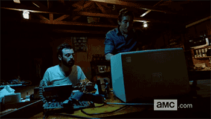

+++
date = '2026-01-31T22:34:24-03:00'
draft = false
title = 'About Me'
+++

I’m a 21 year-old Computer Science student at UNESP and a low-level programming enthusiast. My interest lies where software meets hardware — whether that's manipulating matrices in C, designing for FPGAs or cross-compiling for embedded systems.

**Raw Memory** is my personal knowledge base and dev log. It serves as a persistent "core dump" for my projects in reverse engineering, cybersecurity and hardware hacking. I built this space to document the technical hurdles I encounter while exploring the internals of binaries and systems.

When I'm not fighting the compiler or debugging segfaults, I'm likely analyzing malware behavior, playing videogames (probably replaying Fallout), listening to music (my favorites are doom metal, nu metal and shoegaze) or lifting heavy weights. \
‎ 

‎ 

### Technical Stack

Low-level and firmware
- Languages: C (C99), Rust, VHDL, x86 Assembly
- Embedded: FPGA, PIC, Arduino, cross-compilation toolchains

Reverse engineering
- Analysis: Ghidra, GDB, raw hex lookup

Environment and automation
- Workflow: Arch Linux, i3wm, Neovim
- Build System: Meson
- Scripting: Python

‎ 

‎ 
### Contact Me

- [GitHub](https://www.github.com/lucascesar918)
- E-mail: _lc.freitas@unesp.br_

